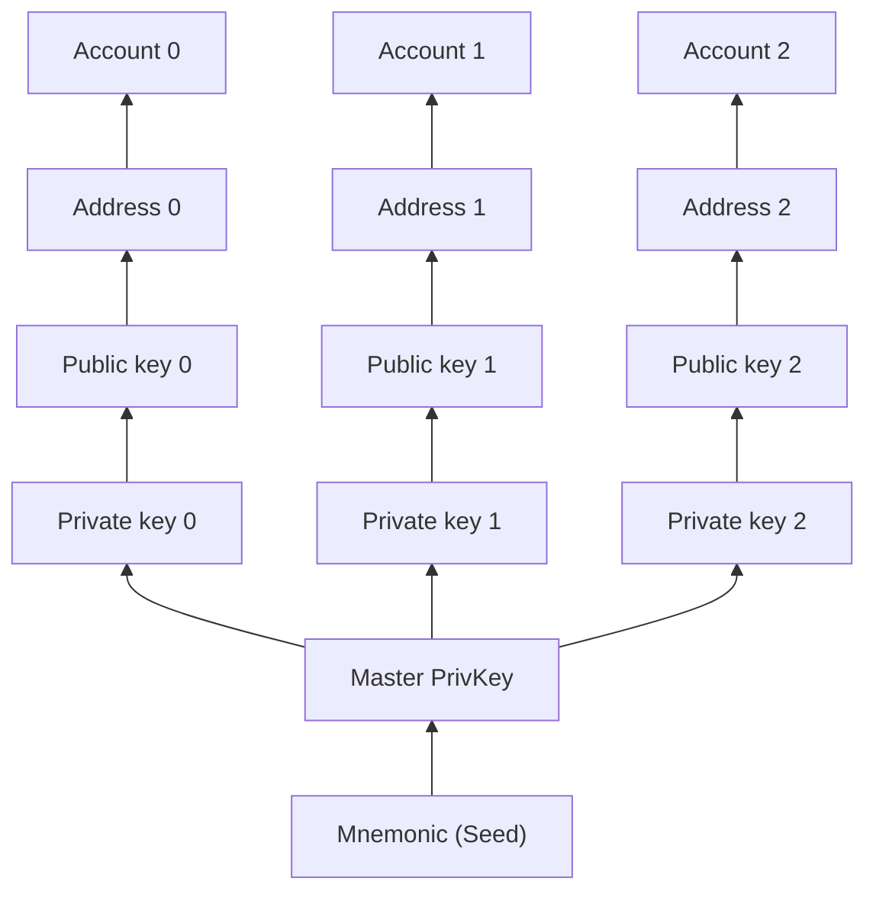

# Accounts

This document describes the built-in account and public key system of the Cosmos SDK.

## Account Definition

In the Cosmos SDK, an _account_ designates a pair of _public key_ `PubKey` and _private key_ `PrivKey`. The `PubKey` can be used to derive different types of `Addresses` (such as account addresses, validator addresses, and consensus addresses), with one unique address generated for each type. These `Addresses` are used to identify various actors in the application. `Addresses` are also associated with [`message`s](../../build/building-modules/02-messages-and-queries.md#messages) to identify the sender of the `message`. The `PrivKey` is used to generate [digital signatures](#keys-accounts-addresses-and-signatures) to prove that an `Address` associated with the `PrivKey` approved of a given `message`.

For HD key derivation the Cosmos SDK uses a standard called [BIP32](https://github.com/bitcoin/bips/blob/master/bip-0032.mediawiki). The BIP32 allows users to create an HD wallet (as specified in [BIP44](https://github.com/bitcoin/bips/blob/master/bip-0044.mediawiki)) - a set of accounts derived from an initial secret seed. A seed is usually created from a 12- or 24-word mnemonic. A single seed can derive any number of `PrivKey`s using a one-way cryptographic function. Then, a `PubKey` can be derived from the `PrivKey`. Naturally, the mnemonic is the most sensitive information, as private keys can always be re-generated if the mnemonic is preserved.



In the Cosmos SDK, keys are stored and managed by using an object called a [`Keyring`](#keyring).

## Keys, accounts, addresses, and signatures

The principal way of authenticating a user is done using [digital signatures](https://en.wikipedia.org/wiki/Digital_signature). Users sign transactions using their own private key. Signature verification is done with the associated public key. For on-chain signature verification purposes, we store the public key in an `Account` object (alongside other data required for a proper transaction validation).

In the node, all data is stored using Protocol Buffers serialization.

The Cosmos SDK supports the following digital key schemes for creating digital signatures:

|                 | Address length in bytes | Public key length in bytes | Used for transaction authentication | Used for consensus (cometbft) |
|:---------------:| :---------------------: | :------------------------: | :---------------------------------: | :-----------------------------: |
|   `secp256k1`   |           20            |             33             |                 yes                 |               no                |
| `eth_secp256k1` |           20            |             33             |                 yes                 |               no                |

## Addresses

`Addresses` and `PubKey`s are both public information that identifies actors in the application. `Account` is used to store authentication information. The basic account implementation is provided by a `BaseAccount` object.

Each account is identified using an `Address` which is a sequence of bytes derived from a public key. In the Cosmos SDK, we define 3 types of addresses that specify a context where an account is used:

* `AccAddress` identifies users (the sender of a `message`).
* `ValAddress` identifies validator operators.
* `ConsAddress` identifies validator nodes that are participating in consensus. Validator nodes are derived using the **`ed25519`** curve.

Of note, the `Marshal()` and `Bytes()` method both return the same raw `[]byte` form of the address. `Marshal()` is required for Protobuf compatibility.

For user interaction, addresses are formatted using [Bech32](https://en.bitcoin.it/wiki/Bech32). This formatting is handled by an address codec. The Bech32 format is the only supported format for interacting with a blockchain. The Bech32 human-readable part (Bech32 prefix) is used to denote an address type. The address codec is responsible for encoding and decoding addresses between their binary representation and the Bech32 string format. Here's an example of how the address codec formats addresses:

```go reference
https://github.com/cosmos/cosmos-sdk/blob/v0.52.0-beta.2/codec/address/bech32_codec.go#L95-L111
```

|                    | Address Bech32 Prefix |
| ------------------ | --------------------- |
| Accounts           | cosmos                |
| Validator Operator | cosmosvaloper         |
| Consensus Nodes    | cosmosvalcons         |


### Module Accounts

Module accounts are special accounts used by modules to perform specific operations within the blockchain. These accounts are not controlled by users but by the modules themselves. Each module account has a unique name and a set of permissions that define what operations it can perform. Examples of module accounts include the distribution module account, which handles the distribution of staking rewards and the governance module account, which manages the funds related to governance proposals.


#### Address Generation

Module account addresses are generated deterministically from the module name, as defined in [ADR-028](../../architecture/adr-028-public-key-addresses.md)

Definition of account permissions is done during the app initialization.

### Public Keys

Public keys in Cosmos SDK are defined by `cryptotypes.PubKey` interface. Since public keys are saved in a store, the `cryptotypes.PubKey` extends the `proto.Message` interface:

A compressed format is used for `secp256k1` and `eth_secp256r1` serialization.

Public Keys are not used to reference accounts (or users) and in general are not used when composing transaction messages (with a few exceptions: `MsgCreateValidator`, `Validator` and `Multisig` messages).
For user interactions, `PubKey` is formatted using Protobufs JSON ([ProtoMarshalJSON](https://github.com/cosmos/cosmos-sdk/blob/v0.52.0-beta.1/codec/json.go#L14-L34) function). Example:

## Keyring

A `Keyring` is an object that stores and manages accounts. In the Cosmos SDK, a `Keyring` implementation follows the `Keyring` interface:

The default implementation of `Keyring` comes from the third-party [`99designs/keyring`](https://github.com/99designs/keyring) library.

A few notes on the `Keyring` methods:

* `Sign(uid string, msg []byte) ([]byte, types.PubKey, error)` strictly deals with the signature of the `msg` bytes. You must prepare and encode the transaction into a canonical `[]byte` form. Because protobuf is not deterministic, it has been decided in [ADR-020](../../architecture/adr-020-protobuf-transaction-encoding.md) that the canonical `payload` to sign is the `SignDoc` struct, deterministically encoded using [ADR-027](../../architecture/adr-027-deterministic-protobuf-serialization.md). Note that signature verification is not implemented in the Cosmos SDK by default, it is deferred to the [`anteHandler`](../advanced/00-baseapp.md#antehandler).

* `NewAccount(uid, mnemonic, bip39Passphrase, hdPath string, algo SignatureAlgo) (*Record, error)` creates a new account based on the [`bip44 path`](https://github.com/bitcoin/bips/blob/master/bip-0044.mediawiki) and persists it on selected backend. The `PrivKey` is **never stored unencrypted**, instead it is [encrypted with a passphrase](https://github.com/cosmos/cosmos-sdk/blob/v0.52.0-beta.1/crypto/armor.go) before being persisted. In the context of this method, the key type and sequence number refers to the segment of the BIP44 derivation path (for example, `0`, `1`, `2`, ...) that is used to derive a private and a public key from the mnemonic. Using the same mnemonic and derivation path, the same `PrivKey`, `PubKey` and `Address` is generated. The following keys are supported by the keyring:

    * `secp256k1`
    * `ed25519`

* `ExportPrivKeyArmor(uid, encryptPassphrase string) (armor string, err error)` exports a private key in ASCII-armored encrypted format using the given passphrase. You can then either import the private key again into the keyring using the `ImportPrivKey(uid, armor, passphrase string)` function or decrypt it into a raw private key using the `UnarmorDecryptPrivKey(armorStr string, passphrase string)` function.

### Create New Key Type

To create a new key type for use in the keyring, the `keyring.SignatureAlgo` interface must be fulfilled.

The interface consists in three methods where `Name()` returns the name of the algorithm as a `hd.PubKeyType` and `Derive()` and `Generate()` must return the following functions respectively:

Once the `keyring.SignatureAlgo` has been implemented it must be added to the [list of supported algos](https://github.com/cosmos/cosmos-sdk/blob/v0.52.0-beta.2/crypto/keyring/keyring.go#L209) of the keyring. You can add your new algo to the list by using the [`Option` function](https://github.com/cosmos/cosmos-sdk/blob/v0.52.0-beta.2/crypto/keyring/keyring_other.go#L17).

For simplicity the implementation of a new key type should be done inside the `crypto/hd` package.
There is an example of a working `secp256k1` implementation in [algo.go](https://github.com/cosmos/cosmos-sdk/blob/v0.52.0-beta.2/crypto/hd/algo.go#L42-L79).
